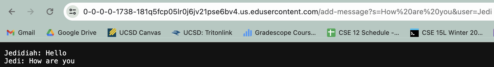
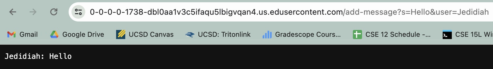

# Servers and SSH Keys

## Part 1

I started with cloning the wavelet folder into my workspace and then made the ChatServer.java file.
I then implemented the file to support this `/add-message?s=<string>&user=<string>` format.
```
import java.io.IOException;
import java.net.URI;
import java.util.ArrayList;

class Handler implements URLHandler {

    private final ArrayList<String> messages = new ArrayList<>();

    public String handleRequest(URI url) {
        if ("/".equals(url.getPath())) {
            return messages.isEmpty() ? "No new messages" : String.join("\n", messages);
        } else if (url.getPath().startsWith("/add-message")) {
            String query = url.getQuery();
            String[] params = query.split("&");
            String user = "", text = "";
            for (String param : params) {
                String[] keyValue = param.split("=");
                if ("user".equals(keyValue[0])) {
                    user = keyValue[1];
                } else if ("text".equals(keyValue[0])) {
                    text = keyValue[1];
                }
            }
            if (!user.isEmpty() && !text.isEmpty()) {
                messages.add(user + ": " + text);
                return "Message added";
            }
        }
        return "404 Not Found!";
    }
}


class ChatServer {
    public static void main(String[] args) throws IOException {
        if (args.length == 0) {
            System.out.println("Missing port number! Try any number between 1024 to 49151");
            return;
        }
        int port = Integer.parseInt(args[0]);
        Server.start(port, new Handler());
    }
}

```

After I complied and ran the program, the server started with "No new messages".
<br/>Then I added the path /add-message?s=Hello&user=Jedidiah to show a user(Jedidiah) say "Hello". 
<br/>The page looked like this:


- This called the handleRequest method.
- The handleRequest method takes in the URL and sees the path added which is /add-message?s=Hello&user=Jedidiah
- It takes the part after "/add-message?" which shows that user = "Jedidiah" and text = "Hello".
It then adds "Jedidiah: Hello" to a list of messages in the program.
<br/>
<br/>Then I added the path /add-message?s=How are you&user=Jedi and it came out like this:


- This called the handleRequest method.
- The handleRequest method takes in the URL and sees the path added which is /add-message?s=How are you&user=Jedi
- It takes the part after "/add-message?" which shows that user = "Jedi" and text = "How are you".

<br/>
<br/>

## Part 2
