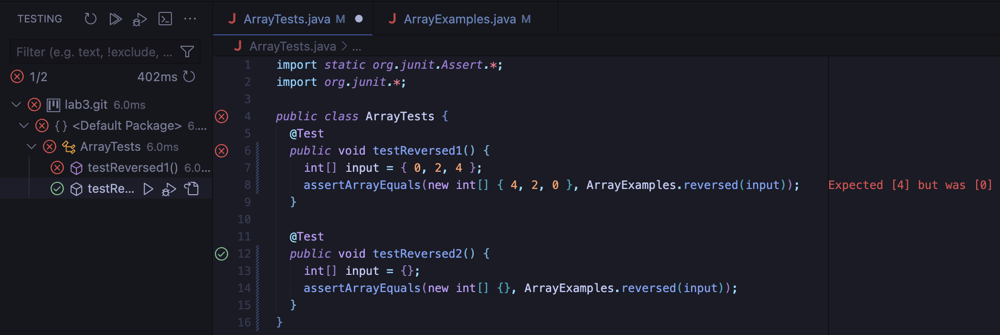

#  Bugs and Commands

## Part 1 - Bugs

I chose the reversed(int[] arr) method, here is the original implementation:
```
  static int[] reversed(int[] arr) {
    int[] newArray = new int[arr.length];
    for(int i = 0; i < arr.length; i += 1) {
      arr[i] = newArray[arr.length - i - 1];
    }
    return arr;
    }
```

Failure Inducing Test:
```
@Test
  public void testReversed1() {
    int[] input = { 0, 2, 4 };
    assertArrayEquals(new int[] { 4, 2, 0 }, ArrayExamples.reversed(input));
  }
```
Successful Test:
```
@Test
  public void testReversed2() {
    int[] input = {};
    assertArrayEquals(new int[] {}, ArrayExamples.reversed(input));
  }
```
The Symptom:


The Bug:
<br/> The bug in reversed(int[] arr) is that it returns the original array arr instead of the new array newArray which is supposed to hold the elements of arr in reversed order.
```
static int[] reversed(int[] arr) {
    int[] newArray = new int[arr.length];
    for(int i = 0; i < arr.length; i += 1) {
      arr[i] = newArray[arr.length - i - 1];
    }
    return arr;
    }
```

## Part 2 - Researching Commands

